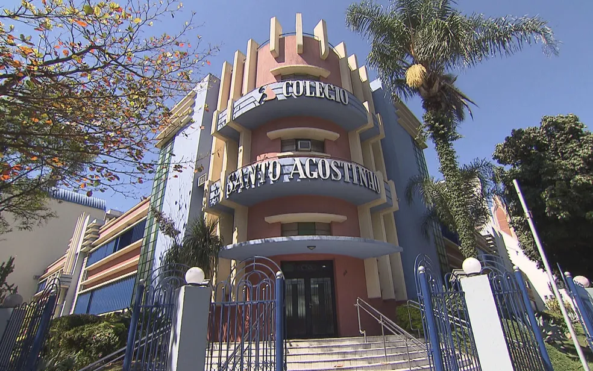

# Colégio Santo Agostinho - Belo Horizonte

## Ensino Básico, Ensino Fundamental e Ensino Médio.

Estudei no Colégio Santo Agostinho de fevereiro de 2009 até dezembro de 2022. Foi onde estudei dos meus quatro anos de idade até os dezoito e também onde tive a oportunidade de me formar. Para acessar a página do colégio, clique [aqui.](https://bh.santoagostinho.com.br)

## High School Canadá - Belo Horizonte

Formado no programa de High School canadense oferecido pelo Colégio Santo Agostinho. O programa teve início em fevereiro de 2020 e término em dezembro de 2022 e é reconhecido pelas instituições na imagem abaixo. Para acessar a página do programa, clique [aqui.](https://bh.santoagostinho.com.br/programa/canadian-high-school)  

